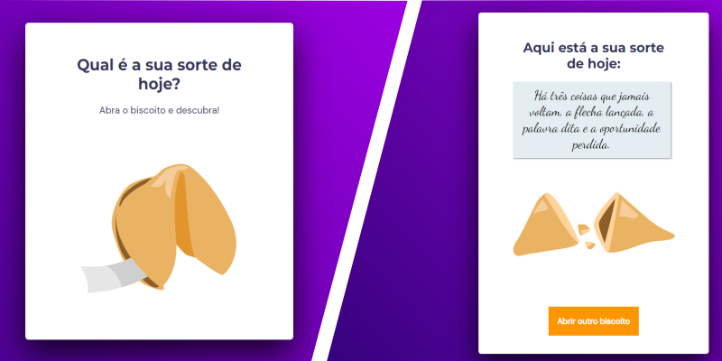

# Intermediate level 05 challenge - fortune cookie

> Trail Explorer 

> Project made to meet intermediate level 05 challenge <b>fortune cookie</b> built in Rocketseat's Explorer course :rocket:. 

## :hammer_and_wrench: Technologies

- HTML
- CSS
- JavaScript
- Git e Github

## :nut_and_bolt: In this project I learned

- Grid;
- Animations e transition, as seen in class;
- Media queries.
- Mobile First;
- Flexible measuring unit;
- Variables;

- We work with alignment and spacing of elements

- Pseudo classes

- Analyze a project with a design made in Figma;
- Use fonts of Google Fonts;
- Position elements on the screen using the property <strong>position: relative</strong>;
- Position elements on the screen using the property <strong>position: absolute</strong>;
- Position elements on the screen using the property <strong>position: fixed</strong>;

## Javascript

- Math
- Random
- QuerySelector
- Arrays
- Functions

## :mailbox_closed: Contacts

> Email - rosendc30@gmail.com

> Linkedin - https://www.linkedin.com/in/francisco-rosendo-a05623241/